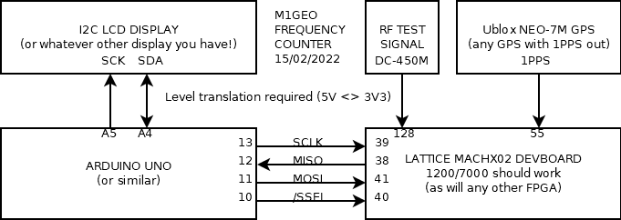
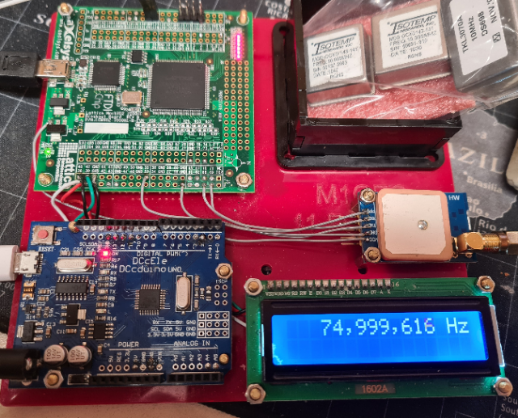

# Frequency Counter Project
A frequency counter based around Ublox NEO-7M GPS's 1PPS output, Lattice MachX02-7000HE (1200HE fine, too) FPGA, Arduino Uno (Nano, etc., fine too) and 16x2 I2C LCD module (or any other display). This is more of a reference project for me, but others may find it useful. The code is thrown together and should be rationalised, but builds cleanly in Arduino 1.8.16 & Lattice Diamond 3.12.0.240.2.

Almost any of the modules can be substituted for whatever you have around. An interesting change would be to swap the 1PPS output for a 10 MHz reference input.

Below, a 75 MHz test signal is input between FPGA pin 128 and ground (3.3 Vpk-pk, 1.65 VDC offset). This test bench below works at 450 MHz without issue.

George, M1GEO.